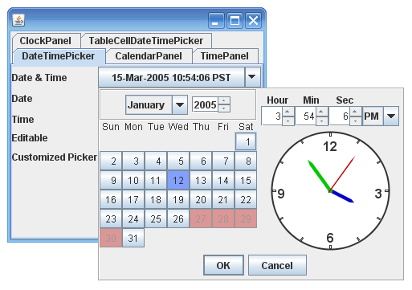
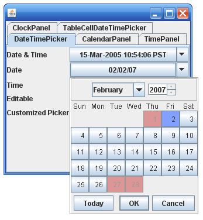
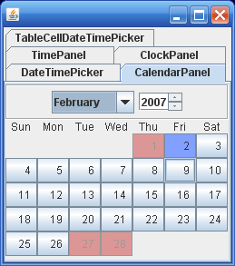
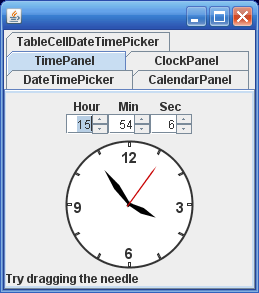
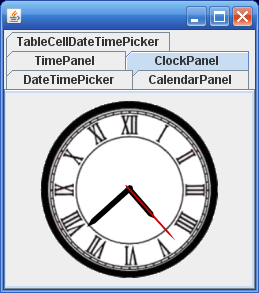

# Java Swing Data Time Picker Component

## Features
* Can be customized to pick Date, Time or Date & Time.
* Unavailable dates can be set. User selection is disabled for unavailable dates.
* Date Time selection can be restricted to a given time range using setMinSelectableTime() and setMaxSelectableTime() methods. 
* Clock needles can be dragged to change time.
* Class Library includes separate Calendar Panel and Clock Panel for other use.
* Unlimited runtime distrubution without any royalty
* GUI components are JavaBean that can be easily installed in IDEs like NetBeans. 
* Clock panel face and needles can be customized.

## Screenshots

## FAQ
[Link to FAQ](faq.html)

## Java Documentation
[Link to Java Documentation](javadoc/index.html)

## License
[GNU Lesser General Public License v3.0 ](LICENSE)